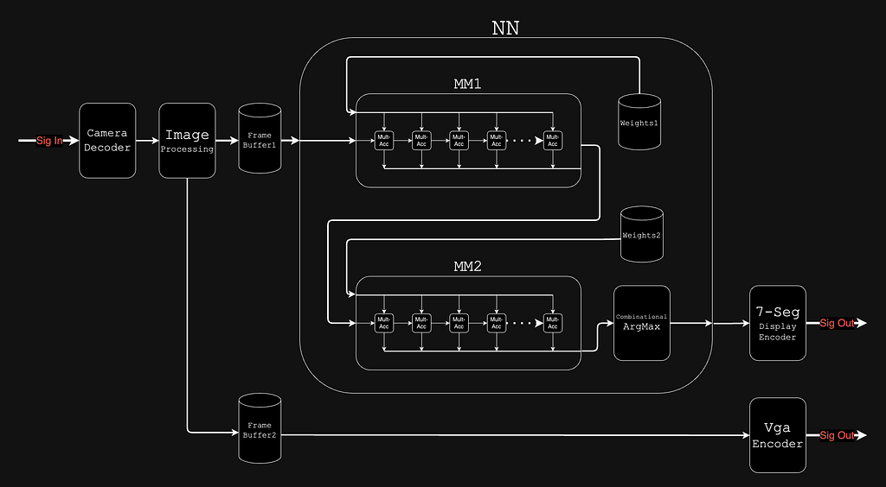
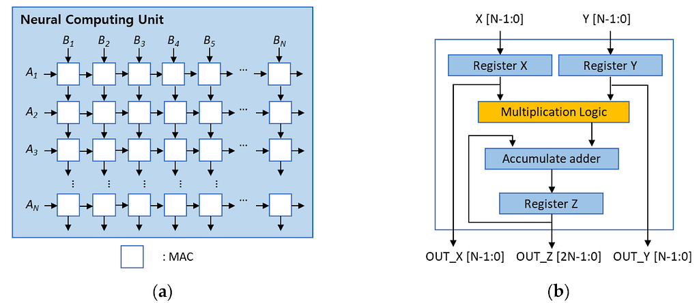
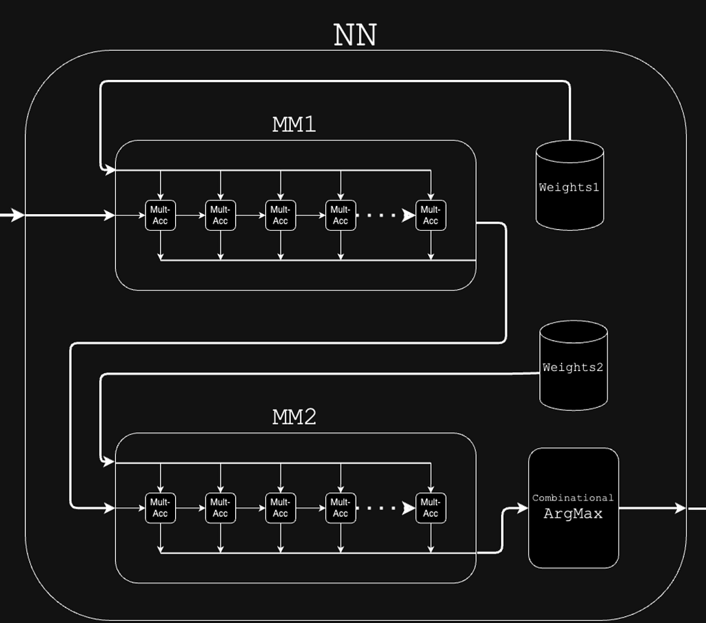
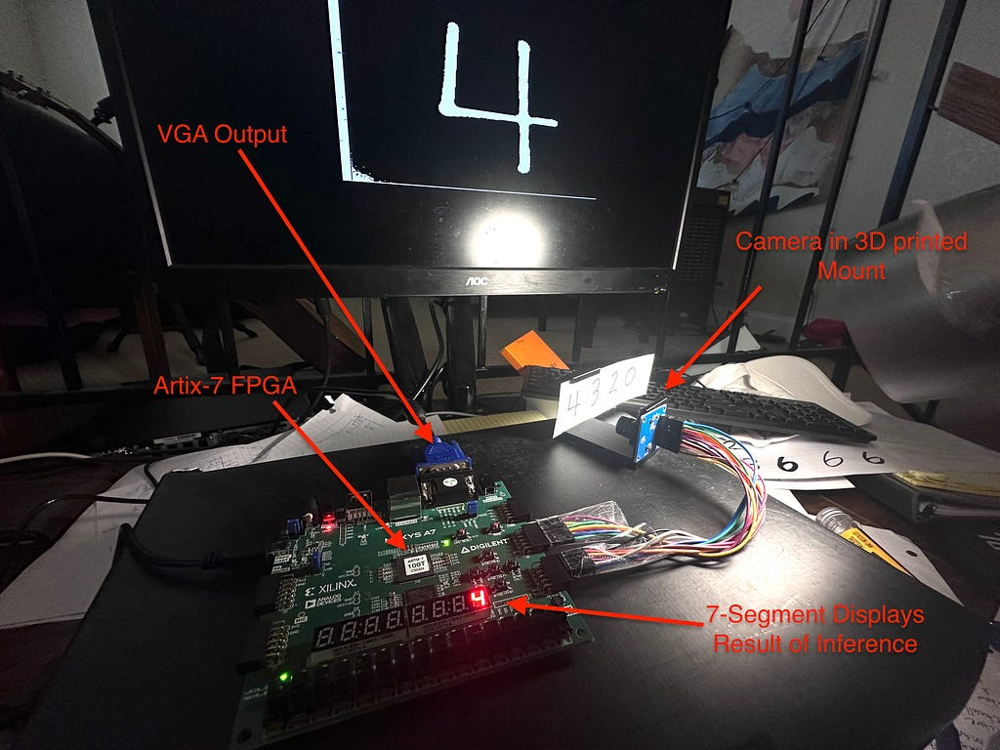
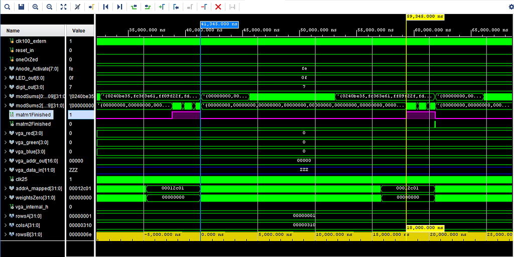
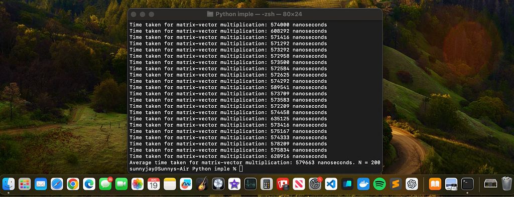

# Building a Hardware Neural Network Accelerator from Scratch with an FPGA

**Saurabh Jayaram**  
*Follow · 7 min read · Aug 25, 2024*

**At the time of this project, the best AI model was GPT-4, which was pretty bad at Verilog. I'm sure as of April 2025, reasoning models such as o4 would have make this project a lot easier.**
**Full technical writeup:** https://medium.com/@sunny.jyrm/building-a-hardware-neural-network-accelerator-from-scratch-with-an-fpga-f2d67c163f20  
**Camera and VGA interfaces forked from:** https://github.com/LIU-Zisen/Basys3-Camera

---

## Table of Contents

1. [Internal Hardware Architecture](#internal-hardware-architecture)  
2. [Core Matrix Multiplier — Systolic Array](#core-matrix-multiplier—systolic-array)  
   - [MAC Module](#mac-module)  
   - [Matrix-Multiply (MM) Module](#matrix-multiply-mm-module)  
3. [Storing and Bussing Weights](#storing-and-bussing-weights)  
4. [Assembling the Network](#assembling-the-network)  
5. [ArgMax Circuit](#argmax-circuit)  
6. [Physical Testing Apparatus](#physical-testing-apparatus)  
7. [Timing Evaluation](#timing-evaluation)  
8. [M2 CPU Comparison](#m2-cpu-comparison)  
9. [Reflection](#reflection)  
10. [Sources](#sources)  

---

## Internal Hardware Architecture

In this article, I’m going to dive into a month’s-long journey to build a neural network accelerator from scratch on an FPGA. The core of the design is a systolic array architecture, which is a popular design for accelerating matrix multiplication (more details below). Exact timing simulations in Vivado revealed that this implementation carries out the required matrix multiplication for running inference **32.2× faster** than C++ on an M2 CPU (Apple clang 14.0.3). All code is available on GitHub: [sun-jay/FPGA-Hardware-NN-Accelerator](https://github.com/sun-jay/FPGA-Hardware-NN-Accelerator).



---

## Core Matrix Multiplier — Systolic Array

The systolic array architecture is already found in many neural network accelerators—including Google’s TPU and Tesla’s Full Self-Driving chip. It leverages the simple, repetitive nature of matrix multiplication and maximizes datapoint reuse. It can carry out an \(n \times n\) matrix multiplication in \(O(n)\) time, at the cost of \(O(n^2)\) hardware area.



### MAC Module

The fundamental unit is the **multiply–accumulate (MAC)** module. Each clock cycle it receives two inputs, multiplies them, adds to a running sum, and forwards the inputs to its neighbors:

```verilog
// Module MAC (chainMod)
always @(posedge clk or posedge reset) begin
    if (reset) begin
        numOutSide <= {bit_res{1'b0}};
        numOutTop  <= {bit_res{1'b0}};
        sum        <= {bit_res{1'b0}};
    end else begin
        // pass A and B on
        numOutSide <= numInSide;
        numOutTop  <= numInTop;

        // multiply and accumulate
        product    = numInSide * numInTop;
        sum        <= sum + (product >>> frac_bits); // fixed-point adjustment
    end
end
```

### Matrix-Multiply (MM) Module

The MM module instantiates a 2D fabric of MACs, chaining outputs horizontally and vertically:

```verilog
// Module MM

// wires for chaining data
wire [bit_res-1:0] chainModInWireA [0:rowsOut-1][0:colsOut];
wire [bit_res-1:0] chainModInWireB [0:rowsOut][0:colsOut-1];
wire [bit_res-1:0] sum_outputs     [0:rowsOut*colsOut-1];

genvar i, j;
generate
    for (i = 0; i < rowsOut; i = i + 1) begin : chains
        for (j = 0; j < colsOut; j = j + 1) begin : mods
            chainMod u_chainMod (
                .clk(clk),
                .reset(reset),
                .numInSide(chainModInWireA[i][j]),
                .numOutSide(chainModInWireA[i][j+1]),
                .numInTop(chainModInWireB[i][j]),
                .numOutTop(chainModInWireB[i+1][j]),
                .sum(sum_outputs[i*colsOut + j])
            );
        end
    end
endgenerate
```

---

## Storing and Bussing Weights

Memory bandwidth is a major constraint. To feed the systolic array, I implemented a multi-node RAM that loads **110 weights per clock cycle**.

```verilog
// Module ramNode
reg [WIDTH-1:0] rom [0:DEPTH-1];

initial begin
    $readmemb(MEM_FILE, rom, 0, DEPTH-1);
end

always @(posedge clk) begin
    if (addr_rd < DEPTH) data_out <= rom[addr_rd];
    else                data_out <= 0;
end
```

The `distRam` module instantiates multiple `ramNode`s to expose many read ports concurrently.

---

## Assembling the Network

The full network chains two MM stages:

1. **MM1** multiplies inputs with **Weights1**.  
2. **MM2** multiplies MM1’s outputs with **Weights2**.

No biases were used (negligible accuracy impact). The dual-MM pipeline embodies the intelligence of the network.



---

## ArgMax Circuit

To extract the predicted digit (0–9), an ArgMax runs in combinational logic on `< 1` cycle:

```verilog
integer i;
reg signed [31:0] max_value;

always @(posedge mm2_finished) begin
    max_value = $signed(mm2.sum_outputs[0]);
    digit_out = 0;

    for (i = 1; i < 10; i = i + 1) begin
        if ($signed(mm2.sum_outputs[i]) > max_value) begin
            max_value = $signed(mm2.sum_outputs[i]);
            digit_out = i;
        end
    end
end
```

---

## Physical Testing Apparatus

I forked [LIU-Zisen/Basys3-Camera](https://github.com/LIU-Zisen/Basys3-Camera) to interface an OV7670 camera and VGA monitor, adding a pipeline to convert 320×240 RGB → 28×28 binary for NN input. The platform is a **Nexys‐A7 100T** dev board.



Realtime demo: [YouTube Video](https://www.youtube.com/watch?v=suAA6G8M_ZM)

---

## Timing Evaluation

The exact time for a matrix multiplication is:

```
time_ns = (uniqueDimA + uniqueDimB + sharedDim + ramLatency + 1) * clockPeriod_ns
```

For a (784×1)·(110×784) fixed-32 multiply:

```
(784 + 110 + 1 + 4 + 1) * 20 ns = 18,000 ns
```

Vivado simulation waveform (pink = MM1 finished) confirms **18 µs** per inference.



---

## M2 CPU Comparison

C++ `matrix_vector_multiply` on random int32 data averaged **579,663 ns** over 200 iterations:

```cpp
void matrix_vector_multiply(
    const vector<vector<int32_t>>& A,
    const vector<int32_t>& v,
    vector<int32_t>& result
) {
    int rows = A.size();
    int cols = A[0].size();
    for (int i = 0; i < rows; ++i) {
        result[i] = 0;
        for (int j = 0; j < cols; ++j) {
            result[i] += A[i][j] * v[j];
        }
    }
}
```

**Speedup:** 579,663 ns / 18,000 ns ≈ **32.2×**



---

## Reflection

This project was an amazing introduction to RTL design—the most primitive form of coding. Despite the 32× speedup, real-world NN acceleration is usually served by GPUs, multi-threaded CPUs, or dedicated silicon (e.g., Apple M2 Neural Engine). FPGAs shine in niche, power- and size-constrained edge scenarios. A future V2 could further optimize timing and resource utilization.

---

## Sources

- Tesla FSD Chip Architecture: https://en.wikichip.org/wiki/tesla_(car_company)/fsd_chip  
- Systolic Array Overview: https://cplu.medium.com/should-we-all-embrace-systolic-array-df3830f193dc  
- “Systolic Arrays for Matrix Multiplication” (arXiv): https://arxiv.org/pdf/1704.04760  
- GitHub Repo: https://github.com/sun-jay/FPGA-Hardware-NN-Accelerator  
- Realtime Demo: https://www.youtube.com/watch?v=suAA6G8M_ZM  
